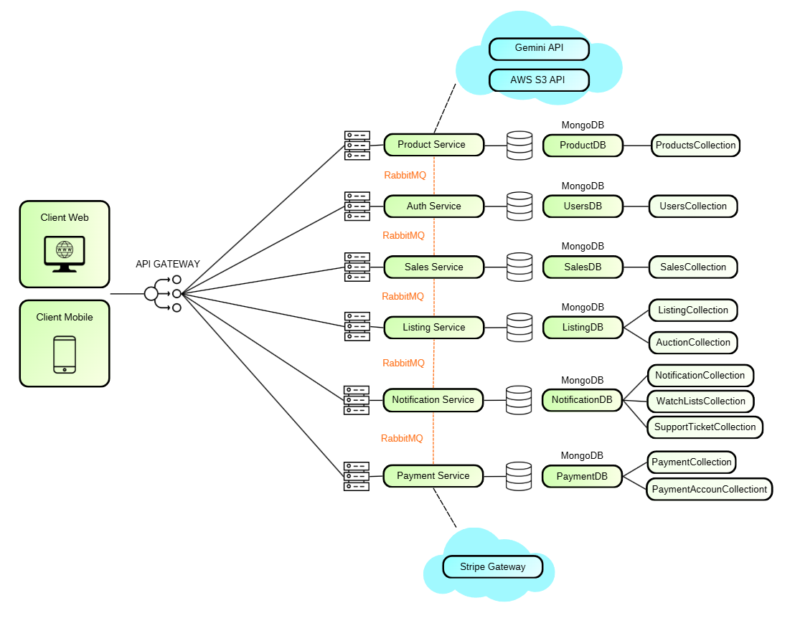



# Comply

Marketplace de itens usados com sistema de leilões, construído como projeto de estudo para simular uma arquitetura escalável baseada em microsserviços e mensageria.

## Demonstração

### Fluxo Principal

Navegação principal da plataforma: listagem de produtos e visualização de detalhes.

---

### Cadastro de Produto

Criação de um novo produto pelo vendedor.

---

### Validação Inteligente de Produto

O sistema utiliza uma camada de validação automatizada para impedir cadastros inconsistentes ou inadequados.

CLIQUE AQUI para ver mais demonstrações

 

### Dashboard do Vendedor

Interface para gerenciamento de produtos e leilões.

---

### Cadastro de Conta

Fluxo de criação de conta de usuário.

---

### Documentação da API (Swagger)

Visualização rápida dos endpoints de um dos microsserviços.

---

## Testes e Infraestrutura

### Testes de Integração

Validação de integrações com serviços externos Amazon S3 e Google Gemma AI.

---

### Ambiente com Docker

Execução dos microsserviços utilizando Docker Compose.

🎬 [Vídeo de apresentação do projeto no Youtube - 10min](https://youtu.be/D-0VdaZQiJI)

## 👥 Autores

- **Lucas Toti (Eu)**
- Matheus Zeíta
- Pedro Henrique
- Pedro Bezerra
- Luan Bezerra

## 👤 Minha contribuição

- Arquitetura de microsserviços com princípios de DDD, CQRS e EDA  
- Implementação dos serviços de leilão (Listings & Auctions) com regras de negócio do sistema  
- Integração com mensageria (RabbitMQ)  
- Controle de concorrência (race conditions) e consistência de dados entre microsserviços (idempotência)
- Docker, Nginx e deploy em VM

Ver mais detalhes técnicos (Clique para expandir)

### Backend:

- Definição da arquitetura backend baseada em microsserviços, aplicando princípios de DDD e CQRS e Arquitetura baseada em eventos (EDA/EDD)
- Implementação dos microsserviços de anúncios e leilões (ciclo completo de anúncios e leilões)
- Integração com mensageria (RabbitMQ através da biblioteca MassTransit)
- Dockerização e orquestração do ambiente completo com docker composes
- Implementação de testes unitários com XUnit e de testes de sistema com Testcontainers
- Resolução de race conditions em lances simultâneos utilizando lock atômico no banco (controle via flag + update condicional)
- Padronização de respostas HTTP e tratamento de erros

### Frontend:

- Implementação de controle de concorrência no refresh token (request queueing com Axios), prevenindo race conditions e múltiplas chamadas simultâneas
- Implementação de fluxo completo de logout com invalidação de sessão no backend
- Otimização de performance com ajuste de cache e refetch (React Query)
- Configuração de proxy reverso com Nginx e adaptação do frontend para múltiplos ambientes via variáveis de ambiente
- Correções de bugs e estabilização de rotas, autenticação e consumo de APIs
- Padronização de logging para debugging e rastreabilidade

### DevOps & Infra

- Dockerização completa da aplicação com múltiplos serviços
- Orquestração com Docker Compose para ambientes de desenvolvimento e produção
- Configuração de rede entre microsserviços para comunicação interna
- Deploy em VM com configuração de ambiente e variáveis externas (.env)
- Configuração de Nginx como proxy reverso centralizando CORS e roteamento

## ⚙️ Tecnologias

### Backend

### Frontend

**Infra & DevOps**

## 🏗️ Arquitetura

O sistema foi projetado utilizando **arquitetura de microsserviços**, com separação por domínios de negócio (Listings, Auctions, Payments, Users, etc).

A comunicação entre serviços ocorre de forma assíncrona via mensageria (RabbitMQ), seguindo o padrão de arquitetura orientada a eventos (EDA) e tratando de consistência de dados. Para operações críticas, são utilizadas chamadas síncronas via HTTP.

O backend é organizado utilizando Clean Architecture e segue princípios de DDD e CQRS, separando responsabilidades de escrita e leitura e mantendo o domínio isolado.

O frontend consome os serviços através de uma API Gateway em Nginx, responsável por roteamento e controle de CORS.

## 📌 Decisões técnicas e desafios

- Uso de uma arquitetura distribuída em microsserviços, mesmo com o aumento enorme de complexidade.
- Para obter maior testabilidade e desacoplamento de sistema, foi utilizado Clean Architecture, que permite maior testabilidade e isolamento do domínio
- Para permitir a comunicação entre os microsserviços de forma mais desacoplada possível foi utilizada mensageria com RabbitMQ, utilizando Pub/Sub (Fanout, no RabbitMQ) para múltiplos serviços reagirem à um mesmo evento.
- Garantir consistência de fluxos e estados entre múltiplos foi um desafio, no qual tratamos idempotencia com Idempotency Key e para cenários de falhas de comunicação, utilizamos padrão SAGA com eventos de compensação.
- Para facilitar desenvolvimento e deploy, foi utilizado Docker para padronizar ambientes.

## 📝 Lições aprendidas

- Microsserviços aumentam a complexidade inicial e raramente são a melhor escolha para um MVP ou projetos menores
- Mensageria exige cuidado com consistência e rastreabilidade entre serviços
- Controle de concorrência é essencial em sistemas com operações críticas (ex: leilões)
- CQRS melhora a organização, mas adiciona overhead de implementação
- Docker facilita a padronização de ambientes, mas exige atenção na configuração
- Clean Architecture favorece desacoplamento e organização, mas aumenta a complexidade estrutural
- Logs são essenciais para rastrear e diagnosticar problemas
- Testes automatizados aumentam a confiabilidade, mas exigem manutenção e devem ser aplicados com critério
