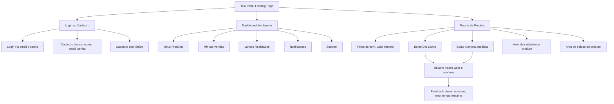

# Projeto de Interface

Pré-requisitos: <a href="2-Especificação do Projeto.md"> Documentação de Especificação</a>

Visão geral da interação do usuário pelas telas do sistema e protótipo interativo das telas com as funcionalidades que fazem parte do sistema (wireframes), tanto da versão web como para a versão mobile.

A proposta do projeto é oferecer uma plataforma de anúncios e leilões online, voltada para compra, venda e gerenciamento de produtos de maneira segura, intuitiva e eficiente. O design da interface foi elaborado para atender aos requisitos funcionais e não funcionais definidos anteriormente, com foco em **usabilidade, clareza visual e fluidez de navegação**.

## Diagrama de Fluxo e Wireframes

O diagrama de fluxo representa o caminho percorrido pelo usuário ao interagir com o sistema, demonstrando as principais telas, menus e funcionalidades, bem como a relação entre elas. Essa representação auxilia na compreensão das jornadas de uso e orienta o design das telas no Figma.

### Estrutura Geral do Fluxo de Usuário

1. **Tela Inicial (Landing Page)**

   * Exibe produtos em destaque e menu superior com opções: *Acessar perfil*, *Buscar produtos*, *Publicar anúncio*.
   * Acesso direto a login e cadastro.

2. **Login / Cadastro**

   * 1. Login via e-mail e senha.
   
   * 2. Cadastro básico com nome, e-mail, senha e confirmação.
   * 3. Cadastro com Stripe.

3. **Página de Produto**

   * 1. Fotos do item, valor mínimo, botão de “Dar lance”, botão de “Compra imediata”.
   * 2. Área de cadastro de produto.
   * 3. Área de edição do produto.
   
4. **Dashboard do Usuário**

   * 1. Acesso aos produtos anunciados.
   * 2. Acesso às minhas vendas.
   * 3. Acesso aos lances realizados, notificações e suporte.

5. **Fluxo de Compra / Lance**

   * Usuário insere valor e confirma.
   * Feedback visual (notificação de sucesso, aviso de erro, tempo restante, etc.).

---

### Representação Visual (Exemplo de Fluxo)

## Wireframes

Os wireframes foram desenvolvidos para representar a estrutura visual das principais telas do sistema. Eles priorizam a clareza na disposição dos elementos, a hierarquia das informações e a consistência entre as versões web e mobile.

 ### Tela Inicial
 

 #### Pesquisa

 

 ### Login e cadastro
 
 

 

 ### Dashboard do usuário

 

 #### Meus anúncios

 

 #### Editar perfil

 

 ### Página do Produto

 

 #### Cadastro de produto

 

 #### Edição de produto

 

 

